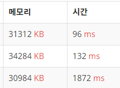

# 백준

## 1181

세가지 방법으로 풀이했다.

- 첫번째 풀이

  딕셔너리를 이용했다.

  단어의 길이를 딕셔너리의 key 값으로 사용해서 같은 길이의 단어들끼리 묵었다.

  그리고 딕셔너리를 단어의 길이인 key 값의 오름차순으로 정렬하고 key 값 마다 반복문을 돌면서 해당 key 의 value 값 배열을 정렬하고 내부 반복문을 돌면서 하나씩 출력해나갔다.

  세가지 풀이 중 메모리는 가장 적게 사용했으나 시간이 10배 가까이 느리게 나왔다.

- 두번째 풀이

  빈 배열에 [단어의 길이, 단어] 배열을 하나씩 추가했다.

  단어의 길이, 단어 순서로 정렬했다.

  정렬 후에 동일한 단어들이 있다면 연속해서 있기 때문에 맨 처음의 요소를 출력한 후에 2번째 요소부터 반복문을 돌면서 앞의 단어와 동일하지 않으면 출력했다.

- 세번째 풀이

  sorted(list)와 list.sort() 모두 key=len 옵션을 줄 수 있다. 길이를 기준으로 정렬할 수 있는 옵션이다. 다만 길이를 기준으로만 정렬하기 때문에 동일한 길이의 요소들끼리는 정렬을 하지 않는다.

  전체 정렬을 오름차순으로 먼저 수행하여 알파벳 순서로 정렬을 시킨후에 동일한 길이를 기준으로 재정렬했다.

  세가지 풀이 중 시간이 가장 빠르게 나왔다.

출력 팁

- sys.stdin.readline().rstrip()

  sys.stdin.readline()을 하게 되면 줄 바꿈 단어 \n 가 함께 들어오기 때문에 rstrip()을 통해 공백문자를 제거하여 입력받을 수 있다.

  int(sys.stdin.readline())로 정수로 변환하면 공백문자가 제거되나 문자로 활용할시에는 공백문자를 함께 입력받는다. 우측 공백문자 제거를 rstrip()을 통해 간단하게 수행할 수 있다.

